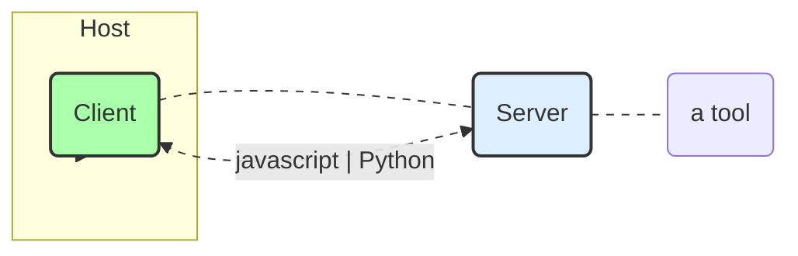

https://huggingface.co/learn/mcp-course/unit2/introduction

実際に Gradio を使って MCP サーバーを構築し、複数のクライアントと接続することで、エンドツーエンドの MCP アプリケーションを構築する方法を学びます。このユニットでは、感情分析ツールを作成し、HuggingFace.js や SmolAgents などの異なるクライアント実装を使用してサーバーに接続します。最終的には、Hugging Face Spaces にサーバーをデプロイし、完全なシステムをテストおよびデバッグします。 <- こんな感じ

## Building an End-to-End MCP Application
本テキストは、MCP（Model Collaboration Protocol）コースのユニット2の概要を示しており、Gradioを使用してサーバーを構築し、複数のクライアントと接続することで、エンドツーエンドのMCPアプリケーションを構築する方法について説明しています。以下に、主なポイントをまとめます。

**ユニット2の目標:** このユニットでは、GradioとHugging Face Hubを使用して、シンプルなMCPサーバーとクライアントを構築することを目標としています。次のユニットでは、より複雑なサーバーを構築し、現実世界のユースケースに取り組みます。

### What You’ll Learn
**学習内容:** このユニットでは、以下の内容を学習します。
* Gradioの組み込みMCPサポートを使用してMCPサーバーを作成する
* AIモデルで使用できる感情分析ツールを構築する
* 異なるクライアント実装を使用してサーバーに接続する：
* HuggingFace.jsベースのクライアント
* SmolAgentsベースのPythonクライアント
* MCPサーバーをHugging Face Spacesにデプロイする
* 完全なシステムをテストおよびデバッグする

### Prerequisites
**前提条件:** このユニットに進む前に、以下の前提条件を満たしている必要があります。
* ユニット1を完了しているか、MCPの基本的な概念を理解している
* PythonとJavaScript/TypeScriptの両方に慣れている
* APIとクライアント-サーバーアーキテクチャの基本的な理解がある
* 開発環境が整っている：
    * Python 3.10+
    * Node.js 18+
    * Hugging Faceアカウント（デプロイメント用）



### Our End-to-End Project
**エンドツーエンドのプロジェクト:** 感情分析アプリケーションを構築します。これは、サーバー、クライアント、デプロイメントの3つの主要部分で構成されています。

#### Server Side
* **サーバー側:** Gradioを使用してWebインターフェースとMCPサーバーを`gr.Interface`経由で作成します。TextBlobを使用して感情分析ツールを実装し、HTTPとMCPプロトコルの両方を介してツールを公開します。

#### Client Side
* **クライアント側:** HuggingFace.jsクライアントを実装するか、smolagents Pythonクライアントを作成します。同じサーバーを異なるクライアント実装で使用する方法を示します。

#### Deployment
* **デプロイメント:** サーバーをHugging Face Spacesにデプロイし、デプロイされたサーバーで動作するようにクライアントを構成します。

### Let’s Get Started!
**開始:** 開発環境をセットアップし、Gradio MCPサーバーを作成することから始めます。

---

## Building the Gradio MCP Server
**GradioによるMCPサーバー構築:** Gradioを用いることで、感情分析機能を備えたMCP（Model Communication Protocol）サーバーを容易に構築できます。このサーバーは、Webインターフェースを通じて人間が利用できるだけでなく、MCPプロトコルを通じてAIモデルからもアクセス可能です。Gradioの`launch()`関数で`mcp_server=True`を設定することで、Python関数が自動的にMCPツールに変換されます。

### Introduction to Gradio MCP Integration
**Gradio MCP連携の仕組み:** Gradioは、Python関数をMCPツールに変換するプロセスを自動化します。具体的には、入力コンポーネントをツールの引数スキーマにマッピングし、出力コンポーネントから応答フォーマットを決定します。さらに、クライアントとサーバー間の通信のために、HTTP+SSE（Server-Sent Events）上でJSON-RPCを設定し、WebインターフェースとMCPサーバーのエンドポイントを同時に作成します。

### Setting Up the Project
**感情分析MCPサーバーの作成:** プロジェクトディレクトリを作成し、必要な依存関係（`gradio[mcp]` と `textblob`）をインストールします。`app.py`ファイルを作成し、感情分析を行う`sentiment_analysis`関数を定義します。この関数は、TextBlobライブラリを使用してテキストの極性（polarity）と主観性（subjectivity）を分析し、結果をJSON形式で返します。

### Creating the Server
### Understanding the Code
**コードの主要コンポーネント:** `sentiment_analysis`関数はテキストを受け取り、感情分析の結果（極性、主観性、評価）を含む辞書を返します。関数定義のドキュメンテーション文字列（docstring）と型ヒント（type hints）は、GradioがMCPツールのスキーマを生成する上で重要です。`gr.Interface`は、Web UIとMCPサーバーの両方を作成し、入力および出力コンポーネントはツールのスキーマを定義します。`mcp_server=True`を設定することで、MCPサーバーが有効になります。

### Running the Server
### Testing the Server
**サーバーの実行とテスト:** サーバーは`python app.py`コマンドで起動します。Webインターフェースは`http://localhost:7860`で、MCPサーバーは`http://localhost:7860/gradio_api/mcp/sse`で利用可能です。Webインターフェースからテキストを入力して感情分析の結果を確認したり、`http://localhost:7860/gradio_api/mcp/schema`にアクセスしてMCPツールのスキーマを確認したりすることで、サーバーをテストできます。

### Troubleshooting Tips
**トラブルシューティングのヒント:** 関数パラメータと戻り値には必ず型ヒントを指定し、各パラメータに対してArgsブロックを含むドキュメンテーション文字列を追加します。入力引数は文字列として受け入れ、関数内で必要な型に変換することで、MCPクライアントとの互換性が向上します。SSEベースのMCPサーバーをサポートしていないクライアントの場合は、`mcp-remote`を使用します。接続問題が発生した場合は、クライアントとサーバーを再起動し、MCPスキーマが正しいURLで利用可能であることを確認します。

### Deploying to Hugging Face Spaces
**Hugging Face Spacesへのデプロイ:** Hugging Face Spacesにデプロイすることで、作成したMCPサーバーを他のユーザーが利用できるようになります。新しいSpaceを作成し、GradioをSDKとして選択し、`app.py`と`requirements.txt`ファイルをSpaceにpushします。MCPサーバーは`https://YOUR_USERNAME-mcp-sentiment.hf.space/gradio_api/mcp/sse`で利用可能になります。

### Next Steps
**今後のステップ:** MCPサーバーが稼働したため、次はサーバーと対話するクライアントを作成します。HuggingFace.jsベースのクライアントと、SmolAgentsベースのPythonクライアントを実装し、デプロイしたサーバーでテストします。

## Building MCP Clients
**MCPクライアントの構築における概要:** このドキュメントでは、異なるプログラミング言語を使用してMCPサーバーと連携するクライアントの構築方法について解説します。具体的には、HuggingFace.jsを使用したJavaScriptクライアントと、smolagentsを使用したPythonクライアントの実装を取り上げます。MCPサーバーとクライアントの効率的なデプロイには適切な設定が必要であり、MCP仕様は進化しているため、設定方法も変更される可能性があります。ここでは、現在のベストプラクティスに焦点を当てます。

### Configuring MCP Clients
#### MCP Configuration Files
**MCP構成ファイルとその構造:** MCPホストは、構成ファイルを使用してサーバー接続を管理します。これらのファイルは、利用可能なサーバーと、それらに接続する方法を定義します。構成ファイルはシンプルで理解しやすく、主要なMCPホスト間で一貫性があります。標準的なMCP構成ファイルは`mcp.json`という名前で、基本的な構造は以下の通りです。

##### mcp.json Structure

```json
{
  "servers": [
    {
        "name": "MCP Server",
        "transport": {
        "type": "sse",
        "url": "http://localhost:7860/gradio_api/mcp/sse"
        }
    }
  ]
}
```

この例では、SSEトランスポートを使用するように設定された単一のサーバーがあり、ポート7860で実行されているローカルのGradioサーバーに接続します。リモートサーバーのGradioアプリに接続する場合はSSEトランスポートを使用しますが、ローカルスクリプトに接続する場合は、SSEではなくstdioトランスポートを使用することをお勧めします。

##### Configuration for HTTP+SSE Transport
**HTTP+SSEトランスポートの設定:** HTTP+SSEトランスポートを使用するリモートサーバーの場合、構成にはサーバーURLが含まれます。例えば、

```json
{
  "servers": [
    {
      "name": "Remote MCP Server",
      "transport": {
        "type": "sse",
        "url": "https://example.com/gradio_api/mcp/sse"
      }
    }
  ]
}
```

この設定により、UIクライアントはMCPプロトコルを使用してGradio MCPサーバーと通信でき、フロントエンドとMCPサービス間のシームレスな統合が可能になります。

### Configuring a UI MCP Client
#### Basic Configuration
4.  **UI MCPクライアントの設定:** Gradio MCPサーバーを使用する場合、UIクライアントを構成してMCPプロトコルを使用してサーバーに接続できます。新しいファイル`config.json`を作成し、以下の設定を追加します。

```json
{
  "mcpServers": {
    "mcp": {
      "url": "http://localhost:7860/gradio_api/mcp/sse"
    }
  }
}
```

これにより、UIクライアントはMCPプロトコルを使用してGradio MCPサーバーと通信できるようになります。

### Configuring an MCP Client within Cursor IDE
#### Configuration
#### Why We Use mcp-remote

5. **Cursor IDE内でのMCPクライアントの設定:** CursorはMCPを組み込みでサポートしており、デプロイされたMCPサーバーを開発環境に直接接続できます。Cursorの設定（Ctrl + Shift + J / Cmd + Shift + J）→ MCPタブ → 新しいグローバルMCPサーバーの追加で設定します。macOSの場合：

```json
{
  "mcpServers": {
    "sentiment-analysis": {
      "command": "npx",
      "args": [
        "-y",
        "mcp-remote",
        "https://YOURUSENAME-mcp-sentiment.hf.space/gradio_api/mcp/sse",
        "--transport",
        "sse-only"
      ]
    }
  }
}
```

Windowsの場合：

```json
{
  "mcpServers": {
    "sentiment-analysis": {
      "command": "cmd",
      "args": [
        "/c",
        "npx",
        "-y",
        "mcp-remote",
        "https://YOURUSENAME-mcp-sentiment.hf.space/gradio_api/mcp/sse",
        "--transport",
        "sse-only"
      ]
    }
  }
}
```

6.  **mcp-remoteを使用する理由:** Cursorを含むほとんどのMCPクライアントは現在、stdioトランスポート経由のローカルサーバーのみをサポートしており、OAuth認証によるリモートサーバーはまだサポートしていません。 `mcp-remote`ツールは、以下の機能を提供するブリッジソリューションとして機能します。

*   ローカルマシン上でローカルに実行される
*   CursorからリモートMCPサーバーにリクエストを転送する
*   使い慣れた構成ファイル形式を使用する

構成が完了すると、Cursorに感情分析ツールを使用して、コードコメント、ユーザーフィードバック、プルリクエストの説明などのタスクを分析させることができます。
