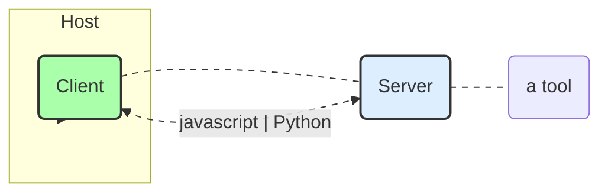
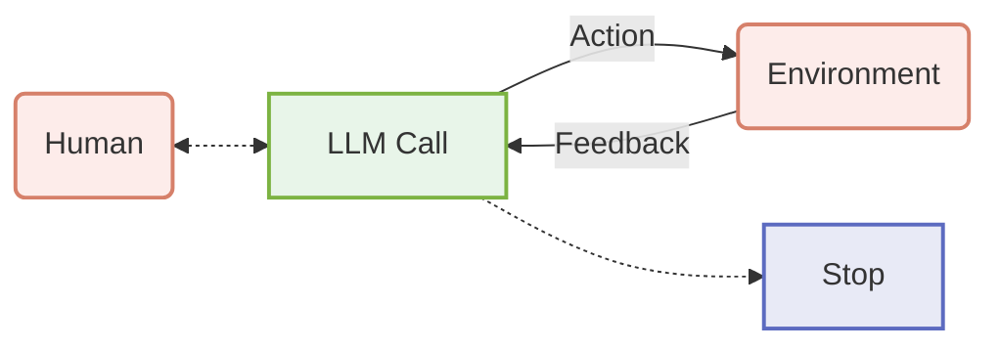

https://huggingface.co/learn/mcp-course/unit2/introduction

実際に Gradio を使って MCP サーバーを構築し、複数のクライアントと接続することで、エンドツーエンドの MCP アプリケーションを構築する方法を学びます。このユニットでは、感情分析ツールを作成し、HuggingFace.js や SmolAgents などの異なるクライアント実装を使用してサーバーに接続します。最終的には、Hugging Face Spaces にサーバーをデプロイし、完全なシステムをテストおよびデバッグします。 <- こんな感じ

## Building an End-to-End MCP Application
本テキストは、MCP（Model Collaboration Protocol）コースのユニット2の概要を示しており、Gradioを使用してサーバーを構築し、複数のクライアントと接続することで、エンドツーエンドのMCPアプリケーションを構築する方法について説明しています。以下に、主なポイントをまとめます。

**ユニット2の目標:** このユニットでは、GradioとHugging Face Hubを使用して、シンプルなMCPサーバーとクライアントを構築することを目標としています。次のユニットでは、より複雑なサーバーを構築し、現実世界のユースケースに取り組みます。

### What You’ll Learn
**学習内容:** このユニットでは、以下の内容を学習します。
* Gradioの組み込みMCPサポートを使用してMCPサーバーを作成する
* AIモデルで使用できる感情分析ツールを構築する
* 異なるクライアント実装を使用してサーバーに接続する：
* HuggingFace.jsベースのクライアント
* SmolAgentsベースのPythonクライアント
* MCPサーバーをHugging Face Spacesにデプロイする
* 完全なシステムをテストおよびデバッグする

### Prerequisites
**前提条件:** このユニットに進む前に、以下の前提条件を満たしている必要があります。
* ユニット1を完了しているか、MCPの基本的な概念を理解している
* PythonとJavaScript/TypeScriptの両方に慣れている
* APIとクライアント-サーバーアーキテクチャの基本的な理解がある
* 開発環境が整っている：
    * Python 3.10+
    * Node.js 18+
    * Hugging Faceアカウント（デプロイメント用）



### Our End-to-End Project
**エンドツーエンドのプロジェクト:** 感情分析アプリケーションを構築します。これは、サーバー、クライアント、デプロイメントの3つの主要部分で構成されています。

#### Server Side
* **サーバー側:** Gradioを使用してWebインターフェースとMCPサーバーを`gr.Interface`経由で作成します。TextBlobを使用して感情分析ツールを実装し、HTTPとMCPプロトコルの両方を介してツールを公開します。

#### Client Side
* **クライアント側:** HuggingFace.jsクライアントを実装するか、smolagents Pythonクライアントを作成します。同じサーバーを異なるクライアント実装で使用する方法を示します。

#### Deployment
* **デプロイメント:** サーバーをHugging Face Spacesにデプロイし、デプロイされたサーバーで動作するようにクライアントを構成します。

### Let’s Get Started!
**開始:** 開発環境をセットアップし、Gradio MCPサーバーを作成することから始めます。

---

## Building the Gradio MCP Server
**GradioによるMCPサーバー構築:** Gradioを用いることで、感情分析機能を備えたMCP（Model Communication Protocol）サーバーを容易に構築できます。このサーバーは、Webインターフェースを通じて人間が利用できるだけでなく、MCPプロトコルを通じてAIモデルからもアクセス可能です。Gradioの`launch()`関数で`mcp_server=True`を設定することで、Python関数が自動的にMCPツールに変換されます。

### Introduction to Gradio MCP Integration
**Gradio MCP連携の仕組み:** Gradioは、Python関数をMCPツールに変換するプロセスを自動化します。具体的には、入力コンポーネントをツールの引数スキーマにマッピングし、出力コンポーネントから応答フォーマットを決定します。さらに、クライアントとサーバー間の通信のために、HTTP+SSE（Server-Sent Events）上でJSON-RPCを設定し、WebインターフェースとMCPサーバーのエンドポイントを同時に作成します。

### Setting Up the Project
**感情分析MCPサーバーの作成:** プロジェクトディレクトリを作成し、必要な依存関係（`gradio[mcp]` と `textblob`）をインストールします。`app.py`ファイルを作成し、感情分析を行う`sentiment_analysis`関数を定義します。この関数は、TextBlobライブラリを使用してテキストの極性（polarity）と主観性（subjectivity）を分析し、結果をJSON形式で返します。

### Creating the Server
### Understanding the Code
**コードの主要コンポーネント:** `sentiment_analysis`関数はテキストを受け取り、感情分析の結果（極性、主観性、評価）を含む辞書を返します。関数定義のドキュメンテーション文字列（docstring）と型ヒント（type hints）は、GradioがMCPツールのスキーマを生成する上で重要です。`gr.Interface`は、Web UIとMCPサーバーの両方を作成し、入力および出力コンポーネントはツールのスキーマを定義します。`mcp_server=True`を設定することで、MCPサーバーが有効になります。

### Running the Server
### Testing the Server
**サーバーの実行とテスト:** サーバーは`python app.py`コマンドで起動します。Webインターフェースは`http://localhost:7860`で、MCPサーバーは`http://localhost:7860/gradio_api/mcp/sse`で利用可能です。Webインターフェースからテキストを入力して感情分析の結果を確認したり、`http://localhost:7860/gradio_api/mcp/schema`にアクセスしてMCPツールのスキーマを確認したりすることで、サーバーをテストできます。

### Troubleshooting Tips
**トラブルシューティングのヒント:** 関数パラメータと戻り値には必ず型ヒントを指定し、各パラメータに対してArgsブロックを含むドキュメンテーション文字列を追加します。入力引数は文字列として受け入れ、関数内で必要な型に変換することで、MCPクライアントとの互換性が向上します。SSEベースのMCPサーバーをサポートしていないクライアントの場合は、`mcp-remote`を使用します。接続問題が発生した場合は、クライアントとサーバーを再起動し、MCPスキーマが正しいURLで利用可能であることを確認します。

### Deploying to Hugging Face Spaces
**Hugging Face Spacesへのデプロイ:** Hugging Face Spacesにデプロイすることで、作成したMCPサーバーを他のユーザーが利用できるようになります。新しいSpaceを作成し、GradioをSDKとして選択し、`app.py`と`requirements.txt`ファイルをSpaceにpushします。MCPサーバーは`https://YOUR_USERNAME-mcp-sentiment.hf.space/gradio_api/mcp/sse`で利用可能になります。

### Next Steps
**今後のステップ:** MCPサーバーが稼働したため、次はサーバーと対話するクライアントを作成します。HuggingFace.jsベースのクライアントと、SmolAgentsベースのPythonクライアントを実装し、デプロイしたサーバーでテストします。

## Building MCP Clients
**MCPクライアントの構築における概要:** このドキュメントでは、異なるプログラミング言語を使用してMCPサーバーと連携するクライアントの構築方法について解説します。具体的には、HuggingFace.jsを使用したJavaScriptクライアントと、smolagentsを使用したPythonクライアントの実装を取り上げます。MCPサーバーとクライアントの効率的なデプロイには適切な設定が必要であり、MCP仕様は進化しているため、設定方法も変更される可能性があります。ここでは、現在のベストプラクティスに焦点を当てます。

### Configuring MCP Clients
#### MCP Configuration Files
**MCP構成ファイルとその構造:** MCPホストは、構成ファイルを使用してサーバー接続を管理します。これらのファイルは、利用可能なサーバーと、それらに接続する方法を定義します。構成ファイルはシンプルで理解しやすく、主要なMCPホスト間で一貫性があります。標準的なMCP構成ファイルは`mcp.json`という名前で、基本的な構造は以下の通りです。

##### mcp.json Structure

```json
{
  "servers": [
    {
        "name": "MCP Server",
        "transport": {
        "type": "sse",
        "url": "http://localhost:7860/gradio_api/mcp/sse"
        }
    }
  ]
}
```

この例では、SSEトランスポートを使用するように設定された単一のサーバーがあり、ポート7860で実行されているローカルのGradioサーバーに接続します。リモートサーバーのGradioアプリに接続する場合はSSEトランスポートを使用しますが、ローカルスクリプトに接続する場合は、SSEではなくstdioトランスポートを使用することをお勧めします。

##### Configuration for HTTP+SSE Transport
**HTTP+SSEトランスポートの設定:** HTTP+SSEトランスポートを使用するリモートサーバーの場合、構成にはサーバーURLが含まれます。例えば、

```json
{
  "servers": [
    {
      "name": "Remote MCP Server",
      "transport": {
        "type": "sse",
        "url": "https://example.com/gradio_api/mcp/sse"
      }
    }
  ]
}
```

この設定により、UIクライアントはMCPプロトコルを使用してGradio MCPサーバーと通信でき、フロントエンドとMCPサービス間のシームレスな統合が可能になります。

### Configuring a UI MCP Client
#### Basic Configuration
4.  **UI MCPクライアントの設定:** Gradio MCPサーバーを使用する場合、UIクライアントを構成してMCPプロトコルを使用してサーバーに接続できます。新しいファイル`config.json`を作成し、以下の設定を追加します。

```json
{
  "mcpServers": {
    "mcp": {
      "url": "http://localhost:7860/gradio_api/mcp/sse"
    }
  }
}
```

これにより、UIクライアントはMCPプロトコルを使用してGradio MCPサーバーと通信できるようになります。

### Configuring an MCP Client within Cursor IDE
#### Configuration
#### Why We Use mcp-remote

5. **Cursor IDE内でのMCPクライアントの設定:** CursorはMCPを組み込みでサポートしており、デプロイされたMCPサーバーを開発環境に直接接続できます。Cursorの設定（Ctrl + Shift + J / Cmd + Shift + J）→ MCPタブ → 新しいグローバルMCPサーバーの追加で設定します。macOSの場合：

```json
{
  "mcpServers": {
    "sentiment-analysis": {
      "command": "npx",
      "args": [
        "-y",
        "mcp-remote",
        "https://YOURUSENAME-mcp-sentiment.hf.space/gradio_api/mcp/sse",
        "--transport",
        "sse-only"
      ]
    }
  }
}
```

Windowsの場合：

```json
{
  "mcpServers": {
    "sentiment-analysis": {
      "command": "cmd",
      "args": [
        "/c",
        "npx",
        "-y",
        "mcp-remote",
        "https://YOURUSENAME-mcp-sentiment.hf.space/gradio_api/mcp/sse",
        "--transport",
        "sse-only"
      ]
    }
  }
}
```

6.  **mcp-remoteを使用する理由:** Cursorを含むほとんどのMCPクライアントは現在、stdioトランスポート経由のローカルサーバーのみをサポートしており、OAuth認証によるリモートサーバーはまだサポートしていません。 `mcp-remote`ツールは、以下の機能を提供するブリッジソリューションとして機能します。

*   ローカルマシン上でローカルに実行される
*   CursorからリモートMCPサーバーにリクエストを転送する
*   使い慣れた構成ファイル形式を使用する

構成が完了すると、Cursorに感情分析ツールを使用して、コードコメント、ユーザーフィードバック、プルリクエストの説明などのタスクを分析させることができます。

## Using MCP with Local and Open Source Models
1.  **Continueとローカルモデルの統合**: Continueは、ローカルのオープンソースモデル（Ollamaなど）と連携して、AIコーディングアシスタントを構築するためのツールです。VS CodeやJetBrainsの拡張機能としてインストールできます。Ollama、Llama.cpp、LM Studioなど、複数のローカルモデル実行オプションがあり、Hugging Face Hubからモデルにアクセスできます。重要なのは、Codestral QwenやLlama 3.1xのように、ツール呼び出しが組み込み機能としてサポートされているモデルを使用することです。

### Setup Continue
#### VS Code extension
#### Local Models
**ローカルモデルの設定**: ワークスペースのトップレベルに`.continue/models`フォルダを作成し、モデルプロバイダー（Ollama、Llama.cpp、LM Studioなど）を設定するためのYAMLファイル（例：`local-models.yaml`）を追加します。各モデルには最大コンテキスト長があり、MCPリクエストを複数実行し、より多くのトークンを処理できるように、より大きなコンテキストウィンドウを使用します。例として、llama.cppを使用する場合は、`model`フィールドが使用するモデルと一致するように設定します。

### How it works
#### The tool handshake
**ツールの連携**: ツールは、モデルが外部と連携するための強力な方法を提供します。ツールはJSONオブジェクトとしてモデルに提供され、名前と引数のスキーマが含まれます。たとえば、`filepath`引数を持つ`read_file`ツールは、モデルに特定のファイルの内容を要求する機能を提供します。エージェントモードでは、利用可能なツールがユーザーのチャットリクエストと共に送信され、モデルはレスポンスにツール呼び出しを含めることができます。ユーザーの許可（ツールポリシーが自動に設定されている場合はスキップ）の後、Continueはツールを呼び出し、結果をモデルに返します。



#### Local Model Integration with MCP
**MCP (Model Communication Protocol)サーバーの統合**: Continueは複数のローカルモデルプロバイダーをサポートしており、タスクごとに異なるモデルを使用したり、必要に応じてモデルを切り替えたりできます。既存のMCPサーバーを追加するには、ワークスペースのトップレベルに`.continue/mcpServers`フォルダを作成し、MCPサーバーの設定ファイル（例：`playwright-mcp.yaml`）を追加します。MCPサーバーをテストするには、Playwrightを使用してウェブサイトにアクセスし、データを抽出してファイルに保存するなどのタスクを実行するよう指示します。

### Conclusion
**結論**: Continueとローカルモデル、そしてMCPサーバーを組み合わせることで、コードとデータのプライバシーを保護しながら、最先端のAI機能を活用できる強力な開発ワークフローを実現できます。この設定により、ウェブ自動化からファイル管理まで、完全にローカルマシンで実行される特別なツールを使用してAIアシスタントをカスタマイズできます。Continue Hub MCPエクスプローラーページからさまざまなMCPサーバーを試して、ローカルAIがコーディング体験をどのように変えることができるかを発見しましょう。

## Gradio as an MCP Client
Gradio as an MCP Client (GradioをMCPクライアントとして)

このセクションでは、GradioをModel Context Protocol (MCP)のクライアントとして使用する方法を紹介します。


1.  **GradioによるMCPクライアントの構築と既存MCPサーバーへの接続:** この記事では、GradioをMCPクライアントとして使用し、既存のMCPサーバーに接続する方法を解説しています。GradioはUIクライアントやMCPサーバーの作成に最適ですが、MCPクライアントとしても機能させ、その機能をUIとして公開することが可能です。例として、Hugging Faceで実行されている既存のMCPサーバーに接続し、そのツールを利用して質問に答えるアプリケーションを作成します。

### MCP Client in Gradio
MCP Client in Gradio (GradioにおけるMCPクライアント)


Gradioアプリケーション内でMCPクライアントをセットアップし、利用する基本的な手順を説明します。

* Connect to an example MCP Server (MCPサーバーのサンプルへの接続)
  * MCPClient を使用してリモートのMCPサーバーに接続し、利用可能なツール（機能）の一覧を取得する方法をコードで示します。これにより、サーバー側で定義された「素因数分解」や「チーターの画像生成」といった機能をクライアント側から呼び出す準備が整います。


* Connect to the MCP Server from Gradio (GradioからMCPサーバーへ接続)
  * MCPサーバーから取得したツールを、実際にGradioアプリケーションに組み込む手順を解説します。smolagents ライブラリの CodeAgentを使い、MCPのツールを利用してユーザーの質問に回答するエージェントを作成し、それを gr.ChatInterfaceに接続してチャットUIを構築します。

2.  **必要なライブラリのインストールとMCPクライアントの初期化:** GradioでMCPクライアントを使用するためには、`smolagents[mcp]`、`gradio[mcp]`、`mcp`といったライブラリをインストールする必要があります。その後、`MCPClient`クラスを用いてMCPサーバーに接続し、利用可能なツールを取得します。例では、Hugging Face上の公開MCPサーバーに接続し、`prime_factors`、`generate_cheetah_image`、`image_orientation`、`sepia`などのツールが利用可能であることが示されています。

#### Connect to an example MCP Server
#### Connect to the MCP Server from Gradio
3.  **Gradioインターフェースの構築とエージェントの統合:** MCPクライアントで取得したツールを使用して、質問応答を行うエージェントを作成します。`InferenceClientModel`などのモデルを使用し、`CodeAgent`でツールを組み込むことで、質問に基づいて適切なツールを選択し、実行するエージェントを構築します。作成したエージェントは、Gradioの`ChatInterface`を用いてUIとして公開され、ユーザーは質問を入力することで、エージェントがMCPサーバーのツールを活用して回答を得ることができます。Hugging FaceのAPIトークン (`HF_TOKEN`) を環境変数に設定する必要がある点に注意が必要です。

### Complete Example
Complete Example (完全なコード例)


GradioでMCPクライアントを実装するための、完全なPythonコードを提供します。このコードには、MCPサーバーへの接続、エージェントの初期化、Gradioインターフェースの起動、そしてプログラム終了時に接続を安全に切断するための `try...finally` ブロックまで、全ての要素が含まれています。

4.  **完全なサンプルコードと`finally`ブロックにおけるMCPクライアントの切断:** 記事では、GradioでMCPクライアントを使用する完全なサンプルコードが提供されています。このコードでは、MCPサーバーへの接続、ツールの取得、エージェントの作成、Gradioインターフェースの構築、そしてユーザーとの対話処理が実装されています。特に重要な点として、`finally`ブロック内で`mcp_client.disconnect()`を呼び出してMCPクライアントを明示的に切断する必要があることが強調されています。これは、MCPクライアントが長寿命のオブジェクトであり、プログラム終了時に適切にクローズする必要があるためです。

### Deploying to Hugging Face Spaces
Deploying to Hugging Face Spaces (Hugging Face Spacesへのデプロイ)


作成したGradioのMCPクライアントアプリケーションを、他者が利用できるようにHugging Face Spacesへデプロイする具体的な手順を解説します。新しいSpaceの作成、requirements.txt ファイルの準備、Gitコマンドを使ったコードのアップロード方法などが含まれます。

5.  **Hugging Face Spacesへのデプロイ:** 作成したGradio MCPクライアントアプリケーションをHugging Face Spacesにデプロイする方法が説明されています。これには、Hugging Face Spacesで新しいSpaceを作成し、SDKとしてGradioを選択すること、コード内のMCPサーバーURLを更新すること、必要なライブラリを`requirements.txt`ファイルに記述すること、そしてコードをSpaceにプッシュすることが含まれます。デプロイすることで、作成したアプリケーションを他のユーザーが利用できるようになります。

### Conclusion
Conclusion (結論)

この章のまとめです。GradioをMCPクライアントとして使用し、リモートのMCPサーバーに接続する方法と、そのクライアントアプリケーションをHugging Face Spacesにデプロイする方法について学んだことを振り返ります。

## Building Tiny Agents with MCP and the Hugging Face Hub
Building Tiny Agents with MCP and the Hugging Face Hub (MCPとHugging Face HubでTiny Agentを構築する)

この章では、Model Context Protocol (MCP) と Hugging Face Hub のリソースを活用して、軽量で特化したAIエージェント「Tiny Agent」を構築する方法を学びます。

1.  **MCPとTiny Agentsの概要:** この記事では、Model Context Protocol (MCP) を利用して、感情分析ツールなどの特定の機能を提供するGradioサーバーと連携できるTiny Agentの構築について解説しています。Tiny Agentsは、MCPクライアントを簡単にデプロイする方法を提供し、Gradioベースの感情分析サーバーと通信できるTypeScriptとPythonのMCPクライアントの実装方法を示しています。これにより、Gradio MCPサーバーの構築から、このツールを他の機能と並行して使用できる柔軟なエージェントの作成までの、エンドツーエンドのMCPアプリケーションフローが完成します。

### Installation
Installation (インストール)

Tiny Agent の開発に必要なツールをインストールする手順を説明します。これには、Node.js環境用の npx や mcp-remote、そしてJavaScript/TypeScriptまたはPythonでTiny Agentを扱うための tiny-agents パッケージのインストールが含まれます。


2.  **Tiny Agentsのインストールと設定:** Tiny Agentsを構築するために必要なパッケージのインストールについて説明しています。Node.js、npm (Node Package Manager)、`mcp-remote`パッケージをインストールする必要があります。  
JavaScript環境では、`@huggingface/tiny-agents`パッケージもインストールが必要です。これらのツールは、コマンドライン環境でMCPサーバーを実行するために使用され、PythonとJavaScriptの両方で必要です。

### Tiny Agents MCP Client in the Command Line
Tiny Agents MCP Client in the Command Line (コマンドラインでのTiny Agent MCPクライアント)


コマンドラインからTiny Agentを実行する基本的な方法を解説します。agent.json という設定ファイルを作成し、使用するモデル、プロバイ
ダー、接続するMCPサーバー（前の章で作成したGradioサーバーなど）の情報を記述します。この設定ファイルを使って、`npx @huggingface/tiny-agents run`` コマンドでエージェントを起動できます。

3.  **コマンドラインでのTiny Agents MCPクライアントの作成:** コマンドラインからJSON構成ファイルに基づいてMCPクライアントを作成する方法について説明しています。`agent.json`ファイルには、使用するモデル (`model`)、推論プロバイダー (`provider`)、およびサーバー構成 (`servers`)が含まれます。`mcp-remote`を使用してGradio MCPサーバーに接続する例が示されており、ローカルで実行されているオープンソースモデルに接続する設定例も提示されています。

### Custom Tiny Agents MCP Client
Custom Tiny Agents MCP Client (カスタムTiny Agent MCPクライアント)


Tiny Agentと、これまでに作成したGradioベースのMCPサーバーを連携させる方法を説明します。MCPの標準化されたインターフェースにより、どのようなMCP互換サーバーともエージェントが対話できることを示します。

4.  **カスタムTiny Agents MCPクライアントの構築:** Tiny AgentsとGradio MCPサーバーがどのように連携するかを解説しています。MCPの利点は、エージェントが任意のMCP互換サーバー（以前に構築したGradioベースの感情分析サーバーなど）と標準化された方法で対話できることです。エージェント構成にGradioサーバーを追加することで、Tiny Agentが感情分析ツールを他のツールと組み合わせて使用できるようになります。例えば、ファイルシステムサーバーからテキストを読み込み、Gradioサーバーでその感情を分析し、結果をファイルに書き戻すことができます。

#### Using the Gradio Server with Tiny Agents
* Using the Gradio Server with Tiny Agents (GradioサーバーをTiny Agentで利用する)
エージェントの設定ファイル (agent.json) に、自作したGradio MCPサーバーのURLを追加する方法を具体的に示します。これにより、エージェントはファイルシステム操作などの標準ツールに加えて、Gradioサーバーが提供するカスタムツール（例：感情分析）も利用できるようになります。

#### Deployment Considerations
* Deployment Considerations (デプロイに関する考慮事項)

Gradio MCPサーバーをHugging Face Spacesにデプロイした場合、エージェントの設定ファイルに記述するサーバーURLを、ローカルホストのアドレスからデプロイ先の公開URLに変更する必要がある点を説明します。  
これにより、エージェントはどこからでも公開されたツールを利用できます。

5.  **デプロイメントに関する考慮事項:** Gradio MCPサーバーをHugging Face Spacesにデプロイする際に、エージェント構成のサーバーURLをデプロイされたスペースを指すように更新する必要があることを説明しています。これにより、エージェントはローカルだけでなく、どこからでも感情分析ツールを使用できます。

### Conclusion: Our Complete End-to-End MCP Application
Conclusion: Our Complete End-to-End MCP Application (結論：完全なエンドツーエンドMCPアプリケーション)


このユニットで学んだ内容を総括します。Gradioで感情分析ツールを持つMCPサーバーを作成し、MCPクライアントから接続する方法を学び、最終的にそのツールを利用するTiny Agentを構築しました。  
これにより、MCPがいかにして専門的なツールを標準化されたインターフェースで提供し、再利用可能で強力なAIアプリケーションの構築を可能にするかを示しました。

6.  **エンドツーエンドMCPアプリケーションの完成と今後のステップ:** この記事では、MCPの基本の理解から、エンドツーエンドのアプリケーションの構築までの流れを説明しています。具体的には、感情分析ツールを公開するGradio MCPサーバーの作成、MCPクライアントを使用したサーバーへの接続、そしてTypeScriptとPythonでのTiny Agentの構築が含まれます。MCPのモジュール式アプローチにより、複数のツールプロバイダーへの接続、利用可能なツールの動的な検出、カスタム感情分析ツールの使用、ファイルシステムアクセスやウェブブラウジングなどの他の機能との組み合わせが可能になります。今後のステップとして、Tiny Agentsのブログ記事やドキュメントの確認、そしてTiny Agentsを使用した独自の構築を推奨しています。

### Next Steps
今後の学習への展望を示します。ローカル環境で、特にAMDのNPUやiGPUアクセラレーションを活用してTiny Agentを実行する方法について、次のセクションで探求することを示唆しています。

## 

1.  **AMD NPUとiGPUによるTiny Agentsアプリケーションの高速化:** このテキストでは、AMDのNeural Processing Unit (NPU) と統合GPU (iGPU) を使用して、Tiny Agentsアプリケーションを高速化する方法を紹介します。Lemonade Serverというツールを使用することで、モデルをローカルで実行し、NPUとiGPUのアクセラレーションを活用できます。 Lemonade ServerはWindowsとLinuxで利用可能で、Windows x86/x64ではCPU推論をサポートし、AMD Ryzen™ AI 7000/8000/300シリーズとAMD Radeon™ 7000/9000シリーズではVulkan経由でGPUアクセラレーションが可能です。NPUアクセラレーションは、AMD Ryzen™ AI 300シリーズデバイスでONNX Runtime GenAI (OGA)エンジンによって実現されます。

2.  **Lemonade ServerのセットアップとTiny Agentsの実行:** Lemonade Serverをインストールし、Tiny Agentsアプリケーションを既にインストールしていることを前提としています。Tiny AgentsアプリケーションをAMD NPUとiGPUで実行するには、アプリケーションの設定でLemonade ServerのMCPサーバーを指定します。例として、Qwen3-8B-GGUFモデルは、Vulkanアクセラレーションを通じてAMD GPU上で効率的に動作します。サポートされているモデルのリストは、Lemonade Serverのモデル管理ページで確認できます。

3.  **機密情報をローカルで処理するアシスタントの作成:** ローカルファイルへのアクセスを可能にし、機密情報を完全にオンデバイスで処理するアシスタントを作成する方法を説明します。具体的には、採用プロセスにおいて候補者の履歴書を評価し、データプライバシーを確保しながら意思決定を支援するアシスタントを構築します。これには、Desktop Commander MCPサーバーを使用します。

4.  **Desktop Commander MCPサーバーの設定とagent.jsonファイルの作成:** Desktop Commander MCPサーバーを使用してローカルマシン上でコマンドを実行し、ファイルシステムへのアクセス、ターミナルの制御、コード編集機能を活用します。`file-assistant`というプロジェクトディレクトリを作成し、`agent.json`ファイルを設定して、Jan Nanoモデルを使用するように構成します。 Jan Nanoモデルは、Lemonade Serverのモデル管理ページからダウンロードできます。

5.  **アシスタントのテストと実行:** ジョブ記述ファイル (`job_description.md`) と候補者の履歴書ファイル (`candidates/john_resume.md`) を作成し、アシスタントにこれらのファイルを読み込ませます。Tiny Agentsアプリケーションを実行し、アシスタントにジョブ記述ファイルを読み込ませ、履歴書を評価させ、面接への招待状を作成させます。

6.  **モデルの探索と高速化オプション:** Jan-NanoモデルはVulkanアクセラレーションを利用していましたが、他のモデルや高速化オプションも試すことができます。特に、Windowsアプリケーションで簡潔なコンテキストが必要で、NPU + iGPUアクセラレーションの恩恵を受ける場合は、AMD Ryzen AI 300シリーズPC向けに最適化されたHybridモデル（例：Llama-xLAM-2-8b-fc-r-Hybrid）を試すことができます。これらのモデルは、tool-callingのために特にファインチューニングされており、高速で応答性の高いパフォーマンスを提供します。

7.  **結論:** このユニットでは、AMD NPUとiGPUを使用してTiny Agentsアプリケーションを高速化し、機密情報をローカルで処理するアシスタントを作成する方法を学びました。Lemonade Serverを活用することで、ローカルモデルの高速化とプライバシー保護されたアプリケーション開発が可能です。詳細な情報や追加の例は、Lemonade GitHubリポジトリを参照してください。

## Local Tiny Agents with AMD NPU and iGPU Acceleration
(AMD NPUとiGPUアクセラレーションによるローカルTiny Agent)


この章では、AMDのNPU（Neural Processing Unit）とiGPU（内蔵GPU）を活用して、ローカル環境でTiny Agentを高速に実行する方法について解説します。特に、プライバシーが重要となる機密情報の扱いに焦点を当てます。

### Setup (セットアップ)

ローカルでエージェントを実行するための環境設定手順です。


#### Setup Lemonade Server (Lemonadeサーバーのセットアップ)
ローカルでのモデル推論を可能にする Lemonade Server のインストール方法を説明します。Windows、Linux、macOSそれぞれの環境向けのインストールコマンドが記載されています。

#### Tiny Agents and NPX Setup (Tiny AgentとNPXのセットアップ)
Tiny Agentを実行するために必要なNode.jsとnpx（Node Package Execute）のセットアップ手順を説明します。


### Running your Tiny Agents application with AMD NPU and iGPU (AMD NPUとiGPUでTiny Agentアプリケーションを実行する)

セットアップしたLemonade ServerとTiny Agentを連携させる方法を解説します。agent.json ファイルを更新し、モデルのエンドポイントURLをローカルのLemonade Server (http://localhost:8000/api/) に向けます。これにより、ローカルマシン上で、AMD GPUのVulkanアクセラレーションを活用して効率的にモデルを動かすことができます。


### Creating an assistant to handle sensitive information locally (機密情報をローカルで扱うアシスタントの作成)

ローカルファイルへのアクセスを可能にし、機密情報を安全に扱うアシスタントを作成する具体的なユースケースを示します。


#### Taking it for a spin (試してみる)
採用活動を想定し、ローカルにある職務経歴書（job_description.md）と候補者の履歴書（candidates/john_resume.md）をTiny Agentに読み込ませ、内容を分析・要約させ、最終的に面接の招待状（invitation.md）を作成させるまでの一連の流れをデモンストレーションします。これにより、全ての処理がローカルで完結し、機密情報が外部に送信されないことを示します。


#### Exploring other models and acceleration options (他のモデルとアクセラレーションオプションの探求)
Lemonade Serverでは、Jan-Nano モデル以外にも様々なモデルやアクセラレーションオプションが利用可能であることを紹介します。特に、AMD Ryzen AI 300シリーズPCに最適化されたハイブリッドモデルを使えば、NPUとiGPUを両方活用してさらに効率的な処理が可能になることに言及しています。

### Conclusion (結論)
この章のまとめです。Lemonade ServerとTiny Agentsを組み合わせることで、AMDのハードウェアアクセラレーションを活かし、機密データを安全に扱いながらローカル環境でAIアシスタントを構築・実行する方法を学びました。これにより、プライバシーを保護しつつ、強力なAI機能を活用できることが示されました。

