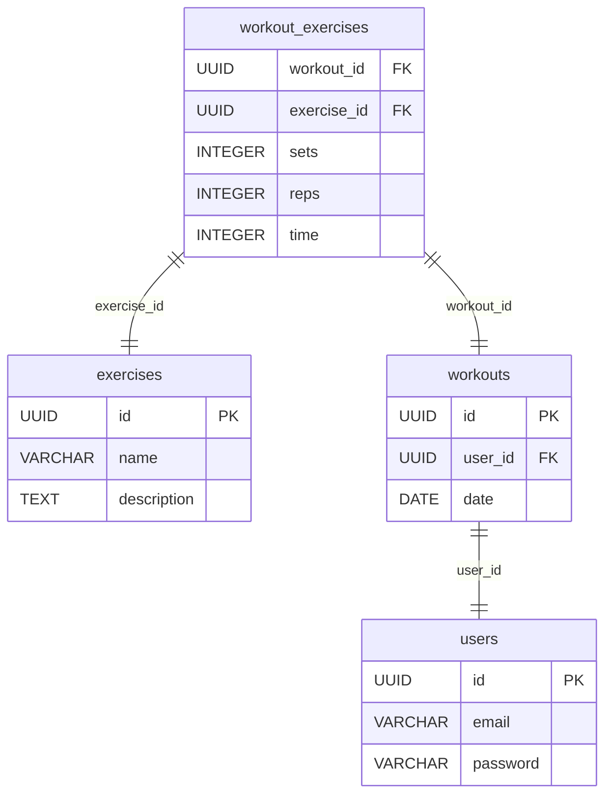

# 001 Create Database Schema

## Status

Accepted

## Context

We need to define a database schema for the workout app to store user data, exercises, workouts, and workout exercises.

## Decision

We have decided to create the following tables:

*   `users`: Stores user information (id, email, password, etc.).
*   `exercises`: Stores information about exercises (id, name, description, etc.).
*   `workouts`: Stores information about workouts (id, user_id, date, etc.).
*   `workout_exercises`: Stores the relationship between workouts and exercises, as well as the sets, reps, and time for each exercise in a workout (workout_id, exercise_id, sets, reps, time).

Here's a Mermaid diagram that visualizes the database schema and relationships:

## Consequences

*   Positive: We have a well-defined database schema that allows us to store and retrieve data for the workout app.
*   Negative: We may need to modify the schema in the future as the app evolves.
