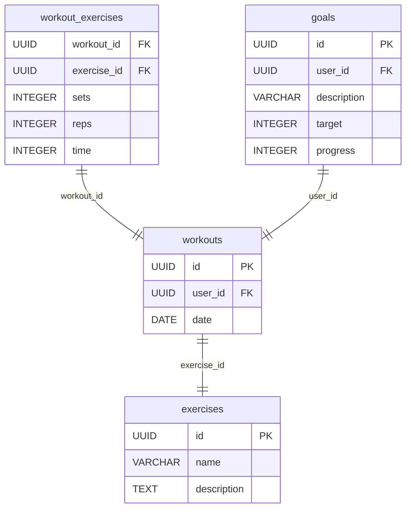

# 003 Add Goals Table

## Status

Accepted

## Context

We need to add a `goals` table to the database schema for the workout app to store user goals. The `users` table has been removed, but the `workouts` table still contains a `user_id` column.

## Decision

We have decided to create the following table:

*   `goals`: Stores user goals (id, user_id, description, target, progress, etc.).

Here's a Mermaid diagram that visualizes the database schema and relationships:

## Consequences

*   Positive: We have a `goals` table that allows us to store and retrieve user goals for the workout app.
*   Negative: We may need to modify the schema in the future as the app evolves. The `goals` table will reference the `workouts` table via `user_id`, even though the `users` table no longer exists. This is not ideal, but it reflects the current state of the database.
