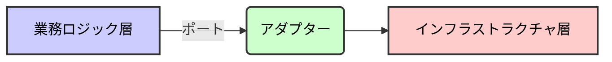
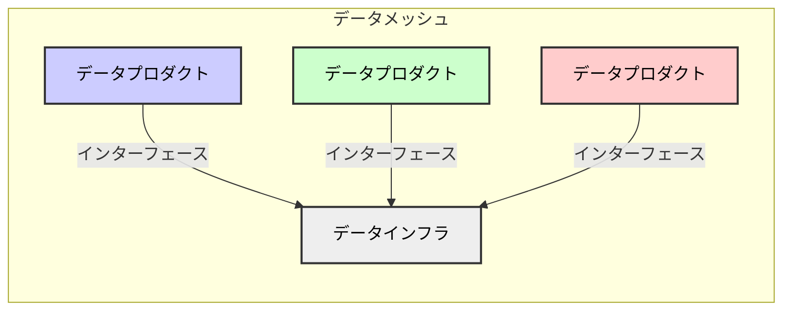

# ドメイン駆動設計をはじめよう
[O'Reilly Japan - ドメイン駆動設計をはじめよう](https://www.oreilly.co.jp/books/9784814400737/)

以下の文章は NotebookLMによる概要を元に作成したものである

## 1. はじめに

この文書では、「ドメイン駆動設計をはじめよう」の内容に基づき、ドメイン駆動設計（DDD）の主要な概念、原則、実践方法、および関連する技術について解説します。この本は、ソフトウェア開発を事業戦略と結びつけ、複雑なドメインを効果的にモデル化し、実装するための実践的なガイダンスを提供することを目的としています。

## 2. 主要テーマと概念

### 2.1. ドメインとサブドメイン

#### ドメイン: ソフトウェアが取り組むビジネス領域全体を指す
「一般的に何か領域を表します。さまざまな使われ方をする、意味の広い言葉です。しかし、本書で扱っているドメイン、つまりソフトウェアが対象とする領域は、一貫して事業活動です。本書の意図をより具体的に伝えるために、ドメインという広い意味の言葉ではなく、対象領域が事業活動であることを明確にしました。」

#### サブドメイン: ドメインを構成する、より小さく、焦点を絞った領域
事業活動（ドメイン）を構成する要素として、分割された領域（サブドメイン）を把握する事が重要。

「ドメイン（事業活動）をさらに細分化したところを、サブドメイン（subdomain）と定義します。事業活動（ドメイン）を構成する要素として、分割された領域（サブドメイン）がある、という全体と部分の関係を表現しています。」

### 2.2. ユビキタス言語 (Ubiquitous Language)

開発者とドメイン専門家が共有する共通の言語。

「ユビキタス言語（ユビキタス用語）は、本書では「一貫して同じ言葉」と訳しています。ユビキタスは「いつも、どこでも」という意味で、関係に関わる人は誰もが「同じ言葉」を使って意図を伝え、開発者はその「同じ言葉」を反映したソースコードを書くことが重要である、というドメイン駆動設計の根幹となる考え方です。」

### 2.3. 境界づけられたコンテキスト (Bounded Context)

ドメインモデルが適用される明確な境界。コンテキスト内ではユビキタス言語が有効。

「Bounded Context（境界づけられたコンテキスト）は区切られた文脈と訳しています。区切られた文脈という考え方は同じ言葉と密接に関係します。言葉の意図は「文脈」によって決まる、というところから、ドメイン駆動設計を特徴づける重要な考え方の一つです。」

---

中核業務領域と一般業務領域は、ドメイン駆動設計において、事業における重要度や特性が異なるため、ソフトウェア開発のアプローチも異なります。

**中核業務領域**は、企業の競争優位性を直接的に生み出す最も重要な領域です。

* 他社との差別化を実現するための独自の技術やノウハウが集中しており、ビジネスの中核となる活動が含まれます。
* この領域では、**高度な設計や開発技術が必要**とされ、**革新的なソフトウェア開発**が求められます。
* **変化が激しい**ため、**アジャイルな開発手法が適しています**。
* 中核領域のソフトウェア開発は、**成長を期待できる若手技術者の育成の場**としても活用できます.
* 例としては、顧客サービス、営業活動における重要な部分、企業の独自技術などが挙げられます.

一方、**一般業務領域**は、既存の解決手段や技術が利用可能な領域です。

* **革新の機会が少なく、他社も同様の活動を行っている領域**であり、**差別化が難しい**とされます。
* この領域の業務は、**比較的変化が少ない**ため、**既存のパッケージソフトウェアや外部サービスを利用する方が効率的**な場合が多いです。
* **経験豊富な技術者が担当し、外部委託も検討**されます。
* 例としては、人事、経理、情報システムなど、企業活動を支える共通的な業務が挙げられます.

以下に、両領域の違いをまとめた表を示します。

| 特徴 | 中核業務領域 | 一般業務領域 |
|---|---|---|
| 競争優位性 | 高い。企業の競争優位性を生み出す | 低い。競争優位性を生み出さない |
| 独自性 | 高い。独自の技術やノウハウが必要 | 低い。既存の技術や手法で対応可能 |
| 複雑さ | 高い。高度な設計や開発技術が必要 | 低い。比較的単純 |
| 変化の度合い | 大きい。変化に柔軟に対応する必要がある | 小さい。比較的安定 |
| 開発アプローチ | 内製が中心、アジャイルな開発手法が適している | 外部サービス利用や外部委託も検討、ウォーターフォール開発が適している場合もある |
| 技術者の役割 | 若手技術者の育成の場としても活用できる | 経験豊富な技術者が担当 |

これらの違いを踏まえ、ソフトウェア開発においては、**中核業務領域に重点的にリソースを投入**し、**高度な技術を適用**する一方で、**一般業務領域では既存の技術や外部サービスを活用**するなど、効率的な開発を目指すことができます.
また、**システムの改善においても、中核業務領域から着手し、徐々に他の領域へと広げていく**ことが推奨されます.

Sourceにも、ドメイン駆動設計における各領域の分類と特徴が表で示されています。Sourceによると、変化のしやすさと重要度の観点から、中核領域は他の領域よりも頻繁に変化する可能性があると指摘されています。

### 2.4. 業務領域の種類

#### 中核 (コア) 領域: 企業の競争優位性を生み出す、最も重要な領域
「もっとも興味深い領域です。他社との差別化を実現し競争優位を生み出すための活動領域です。」

#### 一般的 (ジェネリック) 領域: 既存の解決策が利用可能な領域
革新の機会は少ない。 「既存の解決手段が手に入る業務領域です。どの会社も同じような活動をする領域です。革新の機会が少なく、また革新の必要もない領域です。自社で開発するよりも既存のパッケージソフトや外部サービスを利用する方が費用対効果が高い業務領域です。」

#### 補完 (サポート) 領域: コア領域を支援する、重要度が低い領域
「課題の解決手段がはっきりしている業務領域です。自社で独自に解決する必要がある領域ですが、競争優位を生み出すことのない領域です。」

### 2.5. トランザクションスクリプト

単純な業務ロジックを記述する手順。データ操作を直接的に行う。

「トランザクションスクリプトが向かっているのは、業務ロジックが手続き的な操作、という単純な問題領域です。たとえば、データの ETL（抽出、変換、書き出し）操作です。データソースから必要なデータを抽出し、データ形式の変換を行い、その結果を出力先に書き込むといった図 5-3 のような処理です。」

補完的な業務領域に適している。
複雑な業務には不向き。

### 2.6. アクティブレコード

データベースのテーブルをオブジェクトとして表現。業務ロジックを関連付ける。

「トランザクションスクリプトと同じように、アクティブレコードも単純な業務ロジックの実装方法です。ただし、アクティブレコードは、現在データ構造を操作するため、たとえば、フラットなデータ構造ではなく、図 5-4 のような入り組んだ構造のオブジェクトを扱うことが可能です。」

データ構造が複雑な場合に有効。
トランザクションスクリプトより構造化されているが、複雑な業務には不向き

### 2.7. ドメインモデル

複雑な業務ロジックを表現するためのオブジェクト指向のモデル。値オブジェクト、エンティティ、集約などの概念を扱う。

「ドメインモデルとは、ドメインの業務ロジックをオブジェクトで表現する方法を指します。別の言い方をすると、ドメインモデルのデザインとして不適切なこと（...中略...）ドメインモデルは一つの手段です。どんな手段でもそうですが、使い方によって役には立つはずです。」

### 2.8. 値オブジェクト (Value Object)

識別子を持たない、属性の集合体。不変であるべき。

「値オブジェクト（Value Objects）は、オブジェクト内部のフィールドを区別して識別されるオブジェクトです。例として、色を表現するオブジェクトを考えてみましょう。」

### 2.9. エンティティ (Entity)

識別子を持つオブジェクト。時間の経過とともに変化する可能性がある。

「エンティティ（Entity）は値オブジェクトとは対照的です。エンティティは個々のインスタンスを識別するための識別情報（ID）が必要です。簡単な例として人を（person）をエンティティとして表現してみましょう。」

### 2.10. 集約 (Aggregate)

関連するエンティティと値オブジェクトのグループ。データの整合性を保証するための境界となる。

「集約（Aggregates）はエンティティです。つまり、集約は一般に識別できるエンティティです。そして集約のインスタンスはそのライフサイクルの中で状態が変化します。しかし、集約は単なるエンティティではありません。集約の目標は、データの「一貫性の保証」です。集約の状態は変更可能なので、常に一貫した状態を保証することは、さまざまな意味合いと課題があります。」

### 2.11. イベント駆動型アーキテクチャ

状態の変化をイベントとして表現する。疎結合なシステムを構築できる。
「イベント駆動型アーキテクチャとは、システムのコンポーネント間で、イベントメッセージを非同期でやりとりする技術方式です（図 15-1）。他のコンポーネントのエンドイベントを同期で呼び出すのではなく、コンポーネントは、業務領域で何か起きたことを他のコンポーネントに通知するために、イベントを発行（publish）します。他のコンポーネントはシステムで起きた変化をイベントとして購読（subscribe）し、そのイベントに応じた動作をします。」

### 2.12. コマンドクエリ責任分離 (CQRS)

データの変更と読み取りを分離するパターン。コマンドは状態を変更し、クエリはデータを読み取る。

「CQRSは、システムの状態を変更する操作（コマンド）を実行するために、コマンド実行モデルと読み取りモデルを分離します。このモデルは、業務ロジック、ルールを定義します。そして不変条件の検証に使用します。」  
「読み取りモデルは投影結果のキャッシュです。投影結果は、永続的なデータベース、フラットファイル、インメモリキャッシュなどに存在します。CQRS を適切に実行することで、投影されたすべてのデータを消去し、ゼロから再生することも可能です。また、この方法を用いて、過去の読み取りモデルが常に有効である場合、次の実行では 10 未満の新しいレコードが存在しないようにする必要があます。そうしないと、これらのレコードは投影エンジンによってスキップされ、一貫性のないモデルになります。」

## 3. 実践的な側面

### 3.1. 区切られた文脈間の連携

#### 良いパートナーシップ: 両方の文脈間のコミュニケーションを密にする
「良きパートナー（Partnership）は、区切られた文脈同士の連携を協調関係で実現します。API を変更したチームが他のチームにそのことを伝えると、他のチームは協力的にその変更に対応します。大きくなければ利害関係が競合しません。」

#### モデルの共有: 同じモデルを共有する
「モデルの共有（Shared Kernel）です。共有部分は、関係するすべての区切られた文脈の要求にもとづいて設計することが、きわめて重要です。さらに言えば、共有されたモデルは、それを使いやすくすべての区切られた文脈と整合する必要があります。」

#### 従属: サービスを利用する側が、サービスを提供する側のモデルに合わせる
モデル変換装置 (Anti-Corruption Layer): 異なるモデル間で変換を行う。

「モデル変換装置は、供給側のモデルに合わせることが好ましくない場合、あるいは合わせることに価値がない場合の解決方法です。たとえば次の場合です。」

#### 共有サービス: 共通の機能を提供するサービスを定義
「共有サービス（Open-Host Service）はサービスを提供する側（下流）が決定権を持っている場合の連携方法です。サービスを提供する側（上流）は、サービスの利用者を保護し、利用者にできるだけよい変更をしようとします。」

#### 互いに独立: 各チームが独立して開発できる
「最後の選択肢は連携を「しない」ことです。この方法を互いに独立（Separate Ways）と呼びます。互いに独立を選ぶ理由はいくつかあります。チームどうしが連係を希望しない場合、あるいは連係したくてもできない場合です。」

### 3.2. 業務ロジックの実装

適切な実装方法の選択が重要。業務領域の種類に応じて、トランザクションスクリプト、アクティブレコード、ドメインモデル、イベント駆動型ドメインモデルなどを用いる。

「業務ロジックの実装方法は、業務領域のカテゴリに強く関連します。ですので、業務視点から業務領域を判定する経験則は、図10-3 のように可視化できます。」

### 3.3. イベントストーミング

業務プロセスをモデル化する、ワークショップ形式の手法。ドメイン専門家と開発者が協力して行う。

「イベントストーミングとは、業務プロセスのモデルを迅速に作ることを目的に、関係者が集まって、ブレインストーミングスタイルで進めるローテクな手法です。ある意味で、イベントストーミングは、業務知識を共有するための戦略的なツールと言えるでしょう。」

## 4. 技術的な側面

### 4.1. レイヤードアーキテクチャ

プレゼンテーション層、業務ロジック層、データアクセス層などの層に分割するアーキテクチャ。

「レイヤードアーキテクチャは、最も一般的な技術方式の一つです。レイヤーを明確に整理し、それぞれのレイヤーごとに異なる関心事を取り扱います。つまり、ユーザーとの対話、業務ロジック、そしてデータの永続化です。図 8-1 はその概念図です。」

#### 図8-1 について解説してもらった
図8-1 は **レイヤードアーキテクチャ**の概念図であり、システムを複数の層に分割し、各層が異なる関心事（役割）を担うことを示しています。このアーキテクチャは、システム開発において最も一般的なパターンの一つです。

レイヤードアーキテクチャの主な目的は、**関心の分離**です。つまり、各層は特定の役割に特化し、他の層の内部実装の詳細を知る必要はありません。これにより、システムの複雑さを軽減し、保守性、拡張性、再利用性を向上させることができます。

図8-1では、以下の3つの主要な層が示されています:

* **プレゼンテーション層**: ユーザーインターフェース（UI）を担当する層です。ユーザーからの入力を受け取り、その結果をユーザーに表示する役割を担います。Web UI、CLI、REST APIなどがこの層に含まれます。
* **業務ロジック層**: **アプリケーションのビジネスロジック**を実装する層です。ドメインモデル（エンティティ、ルール、処理など）はこの層に配置されます。この層は、**プレゼンテーション層からの要求に基づいてビジネスルールを実行**し、データアクセス層にデータの永続化を依頼します。
* **データアクセス層**： データの永続化を担当する層です。データベースとのやり取りを抽象化し、**データの取得、保存、更新などの操作を提供**します。インフラストラクチャ層とみなすこともできます。

各層は、それぞれが独立して機能し、特定の責務を担っています。これにより、各層の内部実装を自由に変更することができます。例えば、プレゼンテーション層のUIを変更しても、業務ロジック層やデータアクセス層のコードを変更する必要はありません。

Sourceには、レイヤードアーキテクチャは、**関心の分離**と**コードの再利用**という2つの大きな利点を持つと記載されています。また、各層の依存関係は、上位層から下位層への一方向である必要があり、下位層が上位層に依存しないようにすることが重要です。例えば、プレゼンテーション層は業務ロジック層に依存し、業務ロジック層はデータアクセス層に依存しますが、その逆は避ける必要があります。

Mermaid記法で図示すると以下のようになります。

この図では、プレゼンテーション層が最上位に位置し、ユーザーとの対話を担当します。次に、業務ロジック層がビジネスロジックを処理し、最後にデータアクセス層がデータの永続化を行います。各層は独立しており、互いに疎結合です。

レイヤードアーキテクチャは、**システムの複雑さを管理し、保守性、拡張性、再利用性を向上させる**ための強力なツールです。特に、大規模なシステム開発において、その効果を発揮します。

### 4.2. ポートとアダプター

システムを外部の依存から隔離する。ポートはインターフェースを定義し、アダプターは具体的な実装を提供する。
「ポートとアダプターは、レイヤードアーキテクチャの欠点を解消し、複雑な業務ロジックの実現に適しています。興味深いことに、この二つの技術方式はかなり似ています。」

---

ポートとアダプターアーキテクチャは、レイヤードアーキテクチャの**いくつかの欠点を解消する**ために役立ちます。

レイヤードアーキテクチャの主な欠点として、以下のような点が挙げられます。

* **技術的な依存関係**: レイヤードアーキテクチャでは、上位層が下位層に依存します。これにより、特定の技術（例えば、特定のデータベース）への依存が発生しやすく、システムの**柔軟性やテストの容易さが損なわれる**可能性があります。
* **ビジネスロジックの肥大化**: 業務ロジックが特定のレイヤー（主に業務ロジック層）に集中しやすく、その層が肥大化し、**複雑性が増す**可能性があります。また、**変更の影響が広範囲に及ぶ**可能性もあります。
* **テストの困難さ**: 各層が密接に結合しているため、**単体テストが難しく**なり、テスト対象が広範囲に及ぶため、テストの実施が困難になる場合があります。
* **ドメインモデルの貧血**: レイヤードアーキテクチャでは、ドメインモデルがデータコンテナのように扱われる傾向があり、**ドメインロジックが疎かになる**可能性があります。

ポートとアダプターアーキテクチャは、これらの欠点を以下のように解消します。

* **依存性の分離**: ポートとアダプターアーキテクチャでは、**ポート（インターフェース）**が業務ロジックと外部の依存関係（データベース、UI、外部サービスなど）を分離します。業務ロジックはポートを介してのみ外部とやり取りするため、**外部の具体的な実装に依存せずに動作**できます。
  * ポートは、業務ロジックが必要とする操作を定義する抽象的なインターフェースです。
  * アダプターは、そのインターフェースを実装し、特定の技術（例えば、特定のデータベース）との具体的なやり取りを行います。これにより、業務ロジックは **特定の技術に依存せず、他の技術にも容易に切り替えられる**ようになります。これは、**依存性逆転の原則（DIP)**に基づいています。
* **ビジネスロジックの明確化**: ポートとアダプターアーキテクチャは、**業務ロジックをドメインモデル（エンティティ、値オブジェクト、集約など）として表現すること**を奨励します。これにより、業務ロジックが明確化され、**複雑さが軽減**されます。また、**変更の影響範囲も局所化**されやすくなります。
* **テストの容易さ**: ポートとアダプターアーキテクチャでは、業務ロジックが外部に依存しないため、**単体テストが容易**になります。ポートのインターフェースを実装する**テスト用のダミーアダプター**を用意することで、業務ロジックを外部に依存せずにテストできます。
* **ドメイン駆動設計の促進**: ポートとアダプターアーキテクチャは、ドメイン駆動設計の原則と親和性が高く、**ドメインモデルを中心とした設計**を促進します。これにより、業務ロジックがより明確になり、**ビジネス上の意味に基づいたシステム設計**が可能になります。

Sourceでは、ポートとアダプターアーキテクチャがレイヤードアーキテクチャの欠点を解消し、複雑な業務ロジックの実現に適していると述べられています。この二つの技術方式は非常に似ており、**依存性を分離し、柔軟性やテスト容易性を高める**という共通の目的を持っています。
ポートとアダプターアーキテクチャは、インフラストラクチャ層を独立させ、**ドメインモデルの関心事を維持する**のに役立つとSourceにあります。

ポートとアダプターアーキテクチャは、レイヤードアーキテクチャの課題を解決しつつ、**より柔軟でテスト容易性の高いシステムを構築するための強力な選択肢**となります。特に、**複雑な業務ロジック**を持つシステムや**技術的な変化に頻繁に対応する必要**があるシステムにおいて、その効果を発揮します。

図8-11は、**ポートとアダプターアーキテクチャ**の概念図であり、システムを外部の依存から隔離するための構造を示しています。このアーキテクチャは、**レイヤードアーキテクチャの課題を解決**し、**より柔軟でテスト容易性の高いシステム**を構築するのに役立ちます。

図8-11では、以下の要素が示されています。

* **業務ロジック層**: アプリケーションのコアとなるビジネスロジックを実装する層です。この層は、**特定の技術に依存せずに動作**することが重要です。
* **ポート（インターフェース）**: 業務ロジック層が外部とやり取りするための抽象的なインターフェースを定義します。ポートは、**具体的な技術に依存しない**ため、業務ロジックは柔軟に動作できます。
* **アダプター**: ポートのインターフェースを実装し、具体的な技術（例えば、データベース、UI、外部サービスなど）とのやり取りを行います。アダプターは、**特定の技術に依存**するため、**技術の変更に対応**するために変更されることがあります。
* **インフラストラクチャ層**: データベース、UI、外部サービスなどの外部の技術的な要素を含む層です。

このアーキテクチャでは、業務ロジック層はポートを介してのみ外部とやり取りするため、**外部の具体的な実装に依存せずに動作**できます。これにより、**技術的な依存関係が解消**され、**システムの柔軟性やテストの容易さが向上**します。

Mermaid記法で図示すると以下のようになります。

この図では、業務ロジック層が中心に位置し、ポートを介してアダプターとやり取りします。アダプターは、インフラストラクチャ層の具体的な技術との接続を担当します。
各要素は独立しており、**疎結合**です。

**ポートとアダプターアーキテクチャの重要な利点**は以下の通りです:

* **依存性の分離**: 業務ロジックはポートを介してのみ外部とやり取りするため、特定の技術への依存を回避できます。
* **技術的な柔軟性**: アダプターを交換することで、システム全体のアーキテクチャを変更せずに、**異なる技術に容易に切り替える**ことができます。
* **テスト容易性**: 業務ロジックが外部に依存しないため、**単体テストが容易**になり、**テスト用のダミーアダプター**を用意することで、業務ロジックを外部に依存せずにテストできます。
* **ドメイン駆動設計の促進**: ポートとアダプターアーキテクチャは、ドメイン駆動設計の原則と親和性が高く、**ドメインモデルを中心とした設計**を促進します。

Sourceには、ポートとアダプターアーキテクチャは、**レイヤードアーキテクチャの欠点を解消**し、**複雑な業務ロジックの実現に適している**と述べられています。

ポートとアダプターアーキテクチャは、**システムの柔軟性、保守性、テスト容易性を向上**させるための強力なアーキテクチャパターンです。
特に、**技術的な変化に頻繁に対応する必要**があるシステムや**複雑な業務ロジック**を持つシステムにおいて、その効果を発揮します。

## 5. データメッシュ

分析系データを管理するための新しいアプローチ。ドメイン駆動設計の原則を適用する。
「データメッシュは、ある意味で、分析系データのドメイン駆動設計です。ドメイン駆動設計は、さまざまな方法で境界を切り、境界の内部と外部から保護します。そして、データメッシュは、分析系データのモデルと所有権の境界を定義し、境界内部の基本的な考え方を次のようにします。」

データメッシュは、分析系データのドメイン駆動設計であるという観点から、**データのモデルと所有権の境界を定義し、境界内部の基本的な考え方**を以下のようにします。

* **データをプロダクトとして考える**:
    * 分析系データは、**単一の責任主体**（データプロダクトオーナー）によって管理されるべきです。
    * データは、**プロダクト**として扱われ、**発見可能、理解可能、利用可能**である必要があります。
* データプロダクトは、**データとそれに関するメタデータ**、APIなどを包含します。
* **データへのアクセスと利用**:
    * データプロダクトへのアクセスは、**明確に定義されたインターフェース**（API）を介して行う必要があります。
    * **データの利用者**は、データの**内容と形式を明確に理解**できる必要があります。
* **分散型データ所有権**:
    * データメッシュは、**中央集権的なデータ管理ではなく、各ドメインが自身のデータを所有し、管理する**ことを奨励します。
    * これにより、各ドメインが自身のデータに対して責任を持ち、**データの品質と鮮度を保証**できます。
* **エコシステムを構築する**:
    * データメッシュは、データプロダクト間の**相互運用性**を重視します。
    * 各データプロダクトは、**他のプロダクトと連携してデータを提供、利用**できるようにする必要があります。
* **データの品質と信頼性**:
    * データメッシュでは、データの品質と信頼性を保証するための**明確なルールとプロセス**が必要です。
    * データプロダクトのオーナーは、**データの正確性と整合性**を保証する責任を負います。
* **継続的な改善**:
    * データメッシュは、**変化に合わせて進化**できるようにする必要があります。
    * **データプロダクト**は、利用者のフィードバックに基づいて**継続的に改善**されるべきです。

これらの考え方は、**データメッシュを構成する要素（データプロダクト、ドメイン、データインフラなど）が有機的に連携**し、**分析系データの価値を最大化**することを目的としています。

Sourceには、データメッシュは、分析系データのドメイン駆動設計であり、**さまざまな方法で境界を切り、境界の内部と外部を保護**すると述べられています。また、分析系データのモデルと所有権の境界を定義し、境界内部の基本的な考え方を説明しています。Sourceは、データメッシュの考え方として、データをプロダクトとして捉え、各ドメインが自身のデータを所有し、管理することを推奨しています。また、データプロダクトへのアクセスは明確に定義されたインターフェースを通じて行う必要があり、データの利用者もデータの利用方法を明確に理解できる必要があると説明しています。

データメッシュの概念を図で示すと、以下のようになります。

この図では、**各データプロダクト（A、B、C）**が**独立したエンティティ**として存在し、**データインフラ（D）**を介して相互に連携します。
各データプロダクトは、**それぞれのドメインが所有し、管理**します。
**インターフェース**を通じてデータの提供と利用が行われます。

これらの考え方を実践することにより、データメッシュは、**分散型でスケーラブルな分析系データ管理**を実現し、**データドリブンな意思決定**を促進します。

---

### Q. 示された図はソースのどこを参照したのか？

提示した図は、**ソースの特定の図を直接参照したものではありません**。ただし、図の作成にあたっては、ソースで説明されている**データメッシュの概念**を基にしています。

具体的には、以下のソースの記述と概念に基づいて図を作成しました。

* **データをプロダクトとして考える**: ソースでは、分析系データを**単一の責任主体によって管理**されるべき「プロダクト」として捉えるべきであると説明されています。
    * この考え方を反映して、図では**データプロダクト**を独立したエンティティとして表現しています。
* **データへのアクセスと利用**: ソースでは、データプロダクトへのアクセスは**明確に定義されたインターフェースを介して行う**必要があると述べられています。
    * 図では、データプロダクトとデータインフラ間の**インターフェース**を矢印で表現しています。
* **分散型データ所有権**: ソースでは、**各ドメインが自身のデータを所有し、管理する**ことが推奨されています。
    * 図では、各データプロダクトが独立して存在し、**それぞれが異なるドメインに属している**ことを暗示しています。
* **エコシステムを構築する**: ソースでは、データプロダクト間の**相互運用性**が重要であると述べられています。
    * 図では、各データプロダクトが**データインフラを介して相互に連携**していることを示しています。

これらの概念を基に、データメッシュの基本的な構造を分かりやすく表現するために、図を作成しました。

図は、**データメッシュを構成する要素間の関係性を視覚的に理解**するのに役立つように作成しました。

**図のポイント** 

* **データプロダクト**: 各ドメインが所有するデータのまとまり。
* **データインフラ**: データプロダクトを連携させるための基盤。
* **インターフェース**: データプロダクトへのアクセスを提供するAPIなど。

このように、図はソースの具体的な図を直接参照したものではありませんが、ソースで説明されている**データメッシュの概念を忠実に反映**しています。

## 6. マイクロサービス

独立したサービスとしてシステムを構築する。ドメイン駆動設計の考え方を適用するマイクロサービスとは何かを学びました。

マイクロサービスとは、**単一のアプリケーションを、小さく独立した複数のサービスに分割する**アーキテクチャスタイルです。各サービスは、特定のビジネス機能に特化しており、**独立して開発、デプロイ、スケーリング**が可能です。

ソースでは、マイクロサービスの定義を以下のように述べています:

* **サービスは、独立した機能の単位**であり、明確に定義されたインターフェースを通じて相互に通信します。
* **サービスは、特定のビジネス機能に焦点を当てる**ため、小さく、理解しやすく、変更も容易になります。
* **サービスは、独立してデプロイ**できるため、開発チームは特定のサービスに集中できます。
* **サービスは、独立してスケーリング**できるため、必要に応じて特定サービスの負荷を調整できます。

マイクロサービスのアーキテクチャは、従来のモノリシックなアーキテクチャと比較して、以下のような利点があります:

* **柔軟性**: 各サービスは独立しているため、特定のサービスのみを修正、更新、または置き換えることができます。
* **スケーラビリティ**: 各サービスは独立してスケーリングできるため、負荷の変動に合わせてリソースを効率的に利用できます。
* **開発の迅速化**: 各サービスは独立して開発できるため、開発チームは特定のサービスに集中して、開発を迅速化できます。
* **テクノロジーの多様性**: 各サービスは異なるテクノロジーで開発できるため、最適なテクノロジーを選択できます。
* **障害分離**: あるサービスで障害が発生した場合でも、他のサービスには影響を与えにくいです。

ソースにはマイクロサービスの例として、**キャンペーン公開サービス**のインターフェースが示されています。このサービスは、以下の機能を公開しています。

* `Publish(CampaignId): PublishingResult`
* `Pause(CampaignId): Confirmation`
* `GetStatistics(CampaignId): PublishingStatistics`
* `Deactivate(CampaignId, Reason): PublishingStatus`

これらのインターフェースを通じて、**外部のシステムからキャンペーンを公開、一時停止、統計情報の取得、非アクティブ化**などの操作が可能です。

マイクロサービス間の通信は、一般的に**API**を通じて行われます。各サービスは、他のサービスに対してAPIを公開し、そのAPIを通じて他のサービスとデータを交換したり、機能を呼び出したりします。APIは、RESTやgRPCなどのプロトコルを使用して実装されます。

マイクロサービスの設計では、以下の点に注意が必要です:

* **サービスの粒度**: サービスは、**小さすぎると複雑性が増し、大きすぎると柔軟性が失われる**ため、適切な粒度を決定する必要があります。
* **サービスの境界**: 各サービスは**明確な境界**を持ち、**他のサービスとの依存関係を最小限**にする必要があります。
* **サービスの通信**: サービス間の通信は**効率的かつ信頼性の高い**方法で行う必要があります.
* **サービスのデータ**: 各サービスは、**自身のデータを管理**し、他のサービスとは共有しないようにする必要があります。
* **サービスの監視**: 各サービスは**常に監視**し、問題が発生した場合は迅速に対応する必要があります。

マイクロサービスは、大規模で複雑なシステムを構築する上で非常に有効なアーキテクチャですが、**設計と運用には注意が必要**です。

ソースには、**マイクロサービスとドメイン駆動設計の関係**についても記述されています。ドメイン駆動設計は、ビジネスドメインを理解し、それに基づいてソフトウェアを設計するためのアプローチです。マイクロサービスは、ドメイン駆動設計の考え方を適用するのに適しており、**各サービスは特定のビジネスドメインに焦点を当てる**べきです.

また、マイクロサービスは、**疎結合なコンポーネント**で構成され、**それぞれのコンポーネントが独立して進化**できる点が重要であると述べられています。**変更の影響範囲を局所化**し、システム全体の柔軟性を高めることができます。

マイクロサービスは、**継続的なデリバリー**に適しており、開発チームは**頻繁にコードをデプロイ**できます。これは、**アジャイル開発**と相性が良く、ビジネスの要求に迅速に対応できます.

マイクロサービスの採用は、**組織の文化や体制にも影響**を与えます。開発チームは、**各サービスの責任を明確に分担**し、**自律的にサービスを開発、運用**する必要があります。

さらに、ソースでは、マイクロサービスアーキテクチャを適用する際の**境界の定義**について、複数の切り分け方があることを述べています。例えば、**販売促進**や**営業活動**といったドメインごとにサービスを分割する方法や、**機能**ごとにサービスを分割する方法などが挙げられます。

マイクロサービスは、**システムの複雑さを管理し、柔軟性とスケーラビリティを向上させる**ための有効なアプローチです。しかし、マイクロサービスアーキテクチャを適用する際には、**慎重な設計と運用**が必要であり、システムの**ビジネス要件と技術的な制約**を考慮する必要があります.

## 7. まとめ

この書籍では、ドメイン駆動設計の基本的な概念と実践方法が網羅的に説明されています。ドメイン駆動設計は、ビジネスの複雑さを管理し、より価値のあるソフトウェアを開発するための強力なツールであることが強調されています。

「この章では、事業活動を分析し理解するためのドメイン駆動設計の考え方とやり方を学びました。つまり、事業活動を展開するサービスを理解するところから始まります。」
